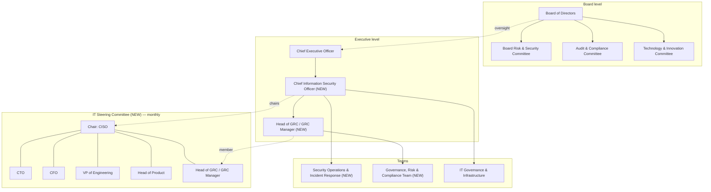

# ACTIVITY 3 — ORGANIZATIONAL STRUCTURE

# VAULTEDGE FINANCIAL TECHNOLOGIES LTD

# GOVERNANCE ORGANIZATIONAL STRUCTURE

Solid lines show reporting relationships. Dotted lines show board oversight and committee participation. Team placement reflects governance accountability; operational infrastructure may still coordinate with engineering leadership.

---

# BOARD LEVEL

## Board

Board of Directors

---

## Committee 1

**Board Risk & Security Committee**

### Responsibilities:

- Oversight of cybersecurity risks
- Governance program oversight
- Review of major security incidents
- Risk appetite approval
- Quarterly security reporting review
- ISO 27001 readiness oversight

---

## Committee 2

**Audit & Compliance Committee**

### Responsibilities:

- Regulatory compliance oversight
- Internal audit coordination
- PCI-DSS and GDPR compliance monitoring
- Review of audit findings and remediation
- Financial and operational control assurance

---

## Committee 3

**Technology & Innovation Committee**

### Responsibilities:

- Oversight of technology strategy
- Cloud governance
- Major technology investments
- Technology risk evaluation
- Alignment between engineering and business goals

---

# EXECUTIVE LEVEL

---

## Role

**Chief Executive Officer (CEO)**

### Responsibilities:

- Executive sponsorship of governance program
- Strategic oversight
- Board communication
- Executive accountability

---

## Role

**Chief Information Security Officer (CISO)** _(NEW ROLE)_

### Responsibilities:

- Enterprise security leadership
- Governance oversight
- Incident response leadership
- Security strategy
- Regulatory and certification readiness
- Board reporting

---

## Reporting Role

**Head of GRC / GRC Manager** _(NEW ROLE)_

### Reports To:

Chief Information Security Officer (CISO)

### Responsibilities:

- Governance coordination
- Risk management program
- Compliance monitoring
- Policy management
- Audit coordination
- KPI tracking
- Vendor risk management
- ISO 27001 program coordination

---

## Executive Committee

**IT Steering Committee** _(NEW COMMITTEE)_

### Chair:

Chief Information Security Officer (CISO)

### Members:

Chief Technology Officer (CTO), Chief Financial Officer (CFO), VP of Engineering, Head of Product, Head of GRC / GRC Manager

### Meeting Cadence:

Monthly

### Responsibilities:

- Align business priorities with security investments
- Review risk changes and compliance resource constraints
- Integrate security strategy into product engineering timelines
- Review security project schedules and governance KPI escalations
- Coordinate cross-functional remediation of off-track governance metrics

---

# TEAMS

---

## Team

**Security Operations & Incident Response Team** _(NEW TEAM)_

### Responsibilities:

- Security monitoring
- Incident detection and response
- SIEM management
- Threat monitoring
- Vulnerability coordination

---

## Team

**Governance, Risk & Compliance (GRC) Team** _(NEW TEAM)_

### Responsibilities:

- Governance implementation
- Risk assessments
- Compliance tracking
- Policy management
- Audit preparation
- Awareness coordination
- Third-party risk management

---

## Team

**IT Governance & Infrastructure Team**

### Responsibilities:

- Asset management
- Access reviews
- Change management
- Business continuity planning
- Disaster recovery coordination
- Infrastructure governance

---

# KEY DESIGN DECISIONS

---

## CISO reports to:

**Chief Executive Officer (CEO)**

---

## Reason

The CISO reports directly to the CEO to ensure:

- independence from engineering and operational pressures,
- direct visibility to executive leadership,
- effective escalation of critical risks,
- stronger governance accountability,
- and alignment with regulatory and investor expectations.

This reporting structure also reduces conflicts of interest that may occur if security reports directly to the CTO, whose primary focus is engineering delivery and product velocity.

---

# New roles/teams being created

### a.

Chief Information Security Officer (CISO)

### b.

Head of Governance, Risk & Compliance (GRC Manager)

### c.

Security Operations & Incident Response Team

---

# Executive committees being established

### a.

IT Steering Committee

---

# Board committees being established

### a.

Board Risk & Security Committee

### b.

Audit & Compliance Committee

### c.

Technology & Innovation Committee
